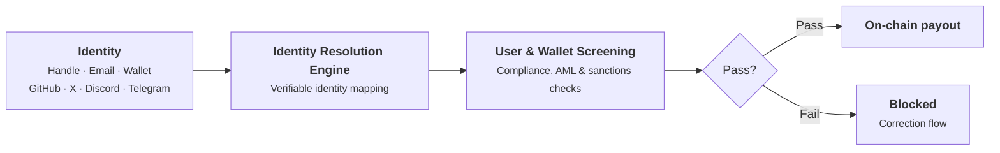

Most payout systems make you collect banking or wallet details before you can pay anyone. Pvium inverts that: you pay people by an identity you already know, and Pvium handles resolving that identity to a real, verified person.

No payout reaches the rail without passing through this pipeline: the identity you entered is mapped to a verified account, the account resolves to a wallet, and compliance, AML, and sanctions screening run before anything settles. A failed check stops the payout — it never fails silently into a wrong or sanctioned wallet.

## Invite identities

A payee can be identified and invited by any of these:

| Identity           | Example                           |
| ------------------ | --------------------------------- |
| **Pvium handle**   | A payee's existing Pvium username |
| **Wallet address** | An Ethereum-compatible address    |
| **Email**          | Any email address                 |
| **GitHub**         | A GitHub username                 |
| **X**              | An X handle                       |
| **Discord**        | A Discord handle                  |
| **Telegram**       | A Telegram handle                 |

This matters in practice because you usually know a contributor by exactly one of these. An open-source maintainer is a GitHub username. A community moderator is a Discord handle. A contractor is an email address. With Pvium, that one identifier is enough to pay them.

## How an identity becomes a payee

An invite is not a payment to an address — it is an invitation tied to a specific identity:

1. **You invite the identity** — a GitHub username, an email, a handle.
2. **The person proves control of it.** To accept, the payee signs in with that identity — OAuth for social accounts and email, a signature for wallets. Whoever cannot authenticate as that identity cannot claim the payout.
3. **The identity resolves to a verified account.** The payee's Pvium account, powered by Privy, a Stripe company, links their identities and wallet in one place — so a payee invited by GitHub handle today can also be found by email tomorrow.

Invites are also cryptographically bound to the payout they belong to, so an invite cannot be redeemed against a different payout or by a different identity than the one you entered.

## Connected accounts

Team members who have already connected their accounts via OAuth appear as **connected accounts** when you add receivers — already resolved, selectable directly from a list. Recurring payees stop being invites and become a roster.

## Why identity-first payouts are safer

- **You pay who you meant to pay.** The payout is claimable only by proving control of the identity you entered — not by whoever holds a link or an address you might have mistyped.
- **No handling of sensitive details.** You never collect, store, or re-type bank or wallet details for payees; each payee's own authenticated account supplies them.
- **Identity connects to compliance.** Once resolved, the same account carries the payee's verification status and tax forms, so identity, compliance, and payment history stay attached to one person.

## Related pages

<CardGroup cols={2}>
  <Card
    title='Scopes and invites'
    icon='key'
    href='/concepts/scopes-and-invites'
  >
    What an invite asks of a payee, and how consented data access works.
  </Card>
  <Card
    title='Recipient verification'
    icon='user-check'
    href='/controls/recipient-verification'
  >
    Verify recipient identity and account information before payout.
  </Card>
</CardGroup>
