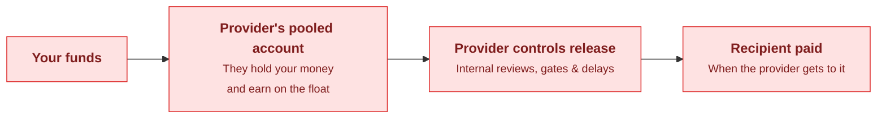
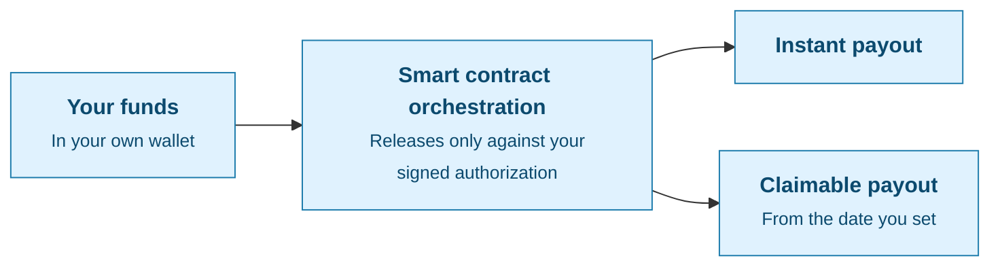

Pvium is non-custodial: your money never sits in a Pvium account. There is no balance to deposit, no funds held on your behalf, and no point in the payout lifecycle where Pvium takes possession of your money. Funds stay with your organization until your team reviews, approves, and funds the payout directly.

**Custodial Platforms**

**Pvium Non-Custodial**

## The core guarantee

Pvium coordinates payouts. It does not control money. Three things follow directly from that:

- **Pvium cannot move your funds.** Every payout run must be explicitly authorized by your organization. Pvium cannot create that authorization for you, alter it after the fact, or redirect an approved payout somewhere else.
- **Your funds are never exposed through Pvium.** Because Pvium holds nothing, there is no Pvium balance that could be frozen, lost, or stolen. An outage or security incident at Pvium does not put your operating funds at risk — they were never there.
- **Pvium does not earn on your money.** Custodial platforms hold your funds and earn on the float while you wait. With Pvium, funds sit in your wallet or in the payout contract — and Pvium makes nothing on them in either place. There is no incentive to hold your money longer, so nothing is gated or delayed.

You do not have to trust Pvium with your money to use Pvium. The system is designed so that trust is not required.

## Wallets powered by Privy, a Stripe company

Non-custodial means your funds stay in your organization's own wallet — and that wallet is powered by Privy, a Stripe company. Privy provides the secure wallet and account infrastructure, so holding your own funds does not mean managing keys or building wallet security yourself.

- **The wallet is yours.** Pvium coordinates payouts around it but cannot spend from it.
- **Security is handled by dedicated infrastructure.** Wallet access and authentication run on Privy's infrastructure, not custom-built account code.
- **Funding is enforced by code, not policy.** When you fund a payout run, funds move through a smart contract escrow that releases them only against your organization's signed, limit-scoped authorizations. Pvium is not an authorizer the contract recognizes.

## Security benefits

Non-custodial design changes your risk profile in concrete ways. Whatever goes wrong — at Pvium, in your team, or with a credential — the damage is bounded by design.

<AccordionGroup>
  <Accordion title="No pooled balance to attack">
    Custodial providers aggregate customer funds into accounts they control, which makes those accounts a single high-value target. With Pvium there is no pre-funded balance sitting with a third party — an attacker who compromised Pvium would find workflow data, not your money. Your funds stay in your organization's own wallet, protected by Privy's authentication and access infrastructure.
  </Accordion>
  <Accordion title="Every payout authorization is scoped and expiring">
    When your organization authorizes a payout run, that authorization is limited by design: a maximum amount per payout, a maximum total for the run, and an expiration. Even a valid authorization cannot spend more than your team approved, cannot be reused beyond its limits, and stops working entirely after it expires. The worst case is always capped at what you already reviewed and signed off.
  </Accordion>
  <Accordion title="Only your organization can authorize funds">
    Every payout authorization is verified against the same organization signer that funded the payout run. An authorization from anyone else — including Pvium — is rejected. There is no support process, admin override, or backdoor that lets a payout execute without your organization behind it.
  </Accordion>
  <Accordion title="A leaked credential cannot drain funds">
    With a custodial provider, a compromised API key can often move stored funds. With Pvium, an API key can create and manage payout records, but it cannot fund anything — funding is a separate, signed step that stays under your control. Even a leaked payout authorization is capped by its limits and dies at its expiration.
  </Accordion>
  <Accordion title="Every failure has a small blast radius">
    The layers compound: a compromised dashboard account cannot move money because funding requires your organization's wallet signature, a compromised API key is bounded by its scopes, a compromised authorization is bounded by its limits and expiry, and a compromised Pvium is bounded by non-custody. No single failure — including ours — reaches your funds.
  </Accordion>
</AccordionGroup>

## Compared with a custodial provider

| | Custodial provider | Pvium (non-custodial) |
| --- | --- | --- |
| Where funds sit before payout | Provider's accounts | Your organization's wallet, powered by Privy |
| Who can move funds | The provider | Only your organization |
| Exposure if provider is breached | Stored funds at risk | Funds not held, not exposed |
| Exposure if provider becomes insolvent or freezes accounts | Funds can be locked or lost | No funds with the provider to lock |
| Spending limits on a payout run | Varies | Per-payout max, run total max, and expiration on every authorization |

## Operational benefits

The same design also makes payout operations easier to reason about:

- Your team controls exactly when money moves — nothing is funded until finance approves it
- Finance can review recipients and totals before funding, not after
- Pvium coordinates recipient checks, approvals, state tracking, and records around the payout
- Payout history remains exportable for reconciliation and audit review

## What Pvium does

Pvium manages the workflow around the payout:

- Recipient and payment checks
- W-8 and W-9 collection when required
- Approval workflows
- Payout state tracking
- Records and exports

## What your organization controls

Your organization — and only your organization — controls payout approval and funding. That separation means compliance, finance, and operations teams can review every payout before money moves, and no payout can move without them.

<Note>
  For account protection, cryptographic payout finalization, and settlement integrity, see [Security](/concepts/security).
</Note>
